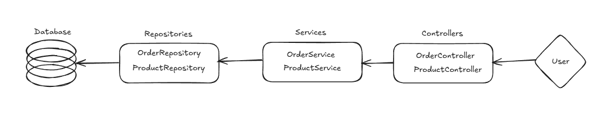

# Raiffeisen Interview Task
A Spring Boot application for managing products and orders with RESTful APIs.

## Project Overview
This application provides functionality to:
- Manage products (CRUD operations)
- Handle orders
- Track product inventory
- Validate orders and products

## Technologies Used
- Spring Boot 3.5.3
- Java 17
- PostgreSQL
- Docker & Docker Compose
- Maven
- Swagger/OpenAPI
- JUnit & Mockito for testing

# How to Run

1. Create a Postgres database
2. Update `application.properties` with your database credentials:
```properties
spring.datasource.url=${SPRING_DATASOURCE_URL:jdbc:postgresql://localhost:5432/mydb}
spring.datasource.username=${SPRING_DATASOURCE_USERNAME:myuser}
spring.datasource.password=${SPRING_DATASOURCE_PASSWORD:mypassword}
```
3. Run the application:

## OR

## Running with Docker Compose

### Prerequisites
- Docker
- Docker Compose

### Steps to Run

1. Build the application:
```
mvn clean package -DskipTests
```
2. Start the application using Docker Compose:
```
docker-compose up -d
```

## API Documentation
Access the Swagger UI documentation at: http://localhost:8080/swagger-ui.html

## Actuator Endpoints
Default base path: `http://localhost:8080/actuator`

Key endpoints:
- Health: `/actuator/health`

## How to run with Postman

1. Import the provided Postman collection file `TaskApiListForPostman.json`.
2. This file was exported from Bruno API application for testing purposes.
3. The file was exported for Postman API application.

## Application Structure
